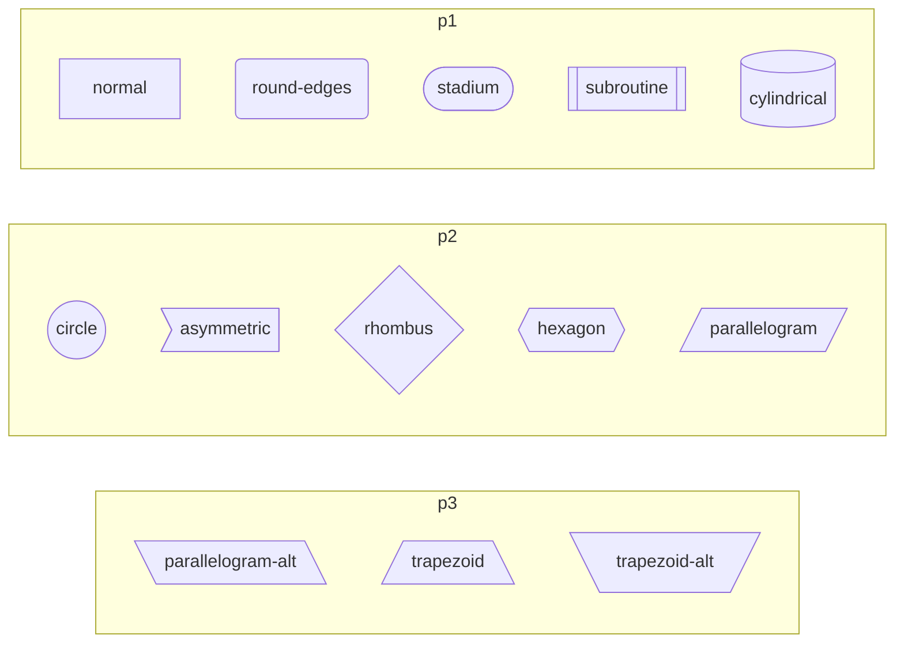
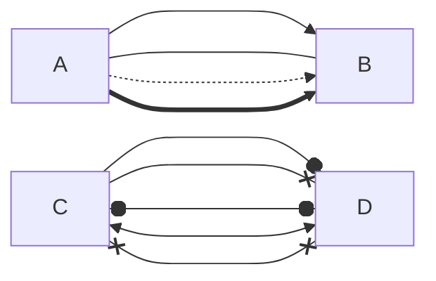
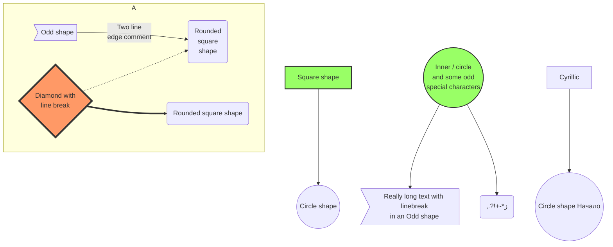

# Flowchart

## 1. Grammar

**flowchart** `Orientation`

​	**subgraph** `Name`

​	    **direction** `Orientation`

​		`Node` `Link` `Node`

​	**end**

​	`Node` `Link` `Node`

## 2. Orientations

| Orientation |        Meaning        |
| :---------: | :-------------------: |
|     TB      |     top to bottom     |
|     TD      | top-down / same as TB |
|     BT      |     bottom to top     |
|     LR      |     left to right     |
|     RL      |     right to left     |

## 3. Name

...

## 4. Node

`Id` `Box(Text)`

| Box Type |      Meaning      |
| :------: | :---------------: |
|    []    |      normal       |
|   ( )    |    round edges    |
|  ([ ])   |      stadium      |
|  [[ ]]   |    subroutine     |
|  [( )]   |    cylindrical    |
|  (( ))   |      circle       |
|   > ]    |    asymmetric     |
|   { }    |      rhombus      |
|  {{ }}   |      hexagon      |
|  [/ /]   |   parallelogram   |
|  [\ \\]  | parallelogram alt |
|  [/ \\]  |     trapezoid     |
|  [\\ /]  |   trapezoid alt   |

e.g.

## 5. Link

`Node1` & `Node2` `Link` `Node3`&`Node4`...

| Normal Link Type |   Meaning   |
| :--------------: | :---------: |
|       -->        | arrow link  |
|       ---        |  open link  |
|       -.->       | dotted link |
|       ==>        | thick link  |

e.g.

## 6. Other Example

